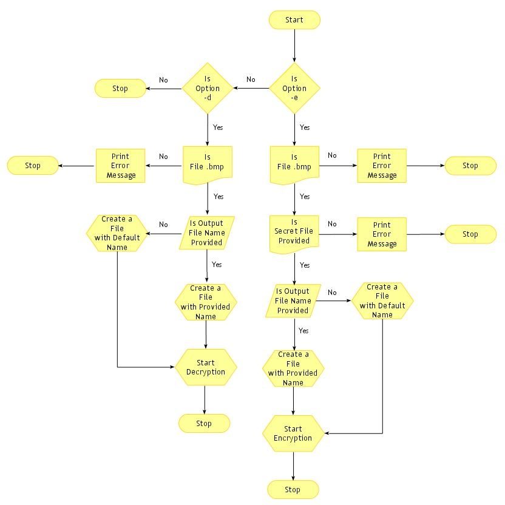

# Steganography System — LSB Image Steganography in C

A command-line application that hides secret data inside BMP image files using **Least Significant Bit (LSB)** encoding, 
and retrieves it back — all without visibly altering the image.

---

## Algorithm / Flow Design


---

## What it does

- **Encode**: Embeds a secret text file inside a BMP image by modifying the least significant bit of each pixel byte
- **Decode**: Extracts the hidden data from a stego image and reconstructs the original secret file
- **Secure**: Uses a magic string watermark to validate authenticity before decoding
- **Capacity check**: Automatically verifies the image is large enough to hold the secret data before encoding

---

## Technologies used

- **Language**: C
- **Platform**: Linux (Ubuntu)
- **Concepts**: Bitwise operations, file I/O, memory management, BMP image format parsing

---

## Project structure

```
├── encode.c        # Encoding logic — embeds secret data into BMP image
├── encode.h        # Encoding function declarations and EncodeInfo struct
├── decode.c        # Decoding logic — extracts hidden data from stego image
├── decode.h        # Decoding function declarations and DecodeInfo struct
├── common.h        # Shared constants (MAGIC_STRING, etc.)
├── types.h         # Custom type definitions (uint, Status)
├── test_encode.c   # Main driver — handles CLI args and dispatches encode/decode
└── beautiful.bmp   # Sample cover image for testing
```

---

## How to compile and run

```bash
# Compile
gcc test_encode.c encode.c decode.c -o steganography

# Encode: hide secret.txt inside beautiful.bmp
./steganography -e beautiful.bmp secret.txt output.bmp

# Decode: extract hidden data from output.bmp
./steganography -d output.bmp recovered_secret
```

---

## How LSB encoding works

Each character of the secret file is 8 bits. These 8 bits are spread across 8 consecutive bytes of the BMP image.
one bit per pixel byte. Only the last bit (LSB) of each pixel is changed, making the image look identical to the 
human eye but carrying hidden data.

```
Original pixel byte:  10110101
Secret bit to hide:          1
Result:               10110101  (LSB set to 1)
```

---

## Key features

- Encodes magic string for validation at decode time
- Stores secret file extension and size inside the image for accurate recovery
- Handles default output filenames gracefully
- Returns structured success/failure status codes throughout

---

## Author

Hassan Sai Siragari — [LinkedIn](https://linkedin.com/in/hassansai-siragari)
